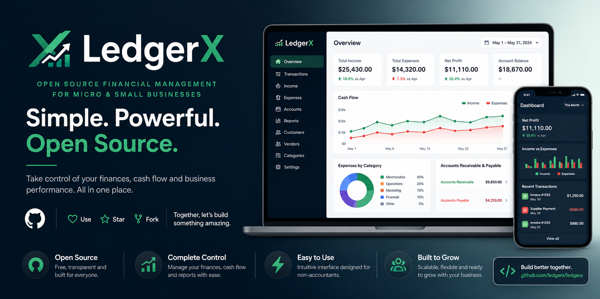

# 🏦 LedgerX Backend

> **An open-source financial management platform for micro and small businesses.**
> Centralize cash accounts, income and expense tracking, accounts receivable and payable, budgets, recurring transactions, and cash-flow reporting behind a robust, secure, and observable REST API.

[](https://openjdk.org/)
[](https://spring.io/projects/spring-boot)
[](https://www.postgresql.org/)
[](https://www.rabbitmq.com/)
[](#-tls--transport-security)
[](#-architecture)
[](#-license)



---

## ✨ Why LedgerX?

|                                      |                                                                                                                                                                       |
| ------------------------------------ | --------------------------------------------------------------------------------------------------------------------------------------------------------------------- |
| 🎯 **Built for small businesses**    | Designed for the operational reality of micro and small businesses, including Brazilian CPF/CNPJ documents and `pt_BR` sample data.                                   |
| 🏗️ **Real Domain-Driven Design**     | Isolated bounded contexts, ports and adapters, and a framework-free domain layer. Not just “DDD-inspired” folder structure.                                           |
| 🔐 **Security by default**           | Argon2id password hashing, Ed25519-signed JWTs, OAuth2 Authorization Code + PKCE, TLS 1.3, SCRAM-SHA-256 database authentication, and encrypted database connections. |
| 📊 **Observability ready**           | OpenTelemetry integration and a Grafana LGTM stack for logs, traces, and metrics during local development.                                                            |
| ⚡ **Performance conscious**         | Tuned HikariCP pooling, Hibernate batch writes, disabled `open-in-view`, and PostgreSQL settings optimized for SSD-backed storage.                                    |
| 🧪 **127 documented business rules** | A catalog of validation, uniqueness, state-transition, and invariant rules cross-referenced with the endpoints that enforce them.                                     |
| 🚀 **Zero-friction local setup**     | Self-generated TLS certificates, realistic seed data, idempotent admin bootstrap, and Docker Compose support.                                                         |

---

## 🧭 Table of Contents

- [Architecture](#-architecture)
- [Bounded Contexts](#bounded-contexts)
- [Technology Stack](#-technology-stack)
- [REST API](#-rest-api)
- [API Documentation](#api-documentation)
- [Authentication](#authentication)
- [Authorization](#authorization)
- [TLS & Transport Security](#-tls--transport-security)
- [Password Hashing & Security Standards](#-password-hashing--security-standards)
- [Database](#-database-postgresql)
- [Sample Data Seeding](#-sample-data-seeding)
- [Running Locally](#-running-locally)
- [Environment Variables](#-environment-variables)
- [Docker](#-docker)
- [Business Rules](#-business-rules)
- [Repository Structure](#-repository-structure)
- [Contributing](#-contributing)
- [License](#-license)

---

## 🏗️ Architecture

LedgerX follows **Domain-Driven Design**, organized as one package per bounded context. Each context is sliced into the classic DDD layers:

```text
┌─────────────────────────────────────────────────────────────────┐
│  interfaces                                                     │  ← inbound adapters
│  REST controllers, request/response DTOs                        │
├─────────────────────────────────────────────────────────────────┤
│  application                                                    │  ← use-case orchestration
│  Use cases, application DTOs, mappers                           │
├─────────────────────────────────────────────────────────────────┤
│  domain                                                         │  ← pure business core
│  Entities, value objects, ports, domain services, events        │
├─────────────────────────────────────────────────────────────────┤
│  infrastructure                                                 │  ← outbound adapters
│  JPA persistence, messaging, security, configuration            │
└─────────────────────────────────────────────────────────────────┘
```

### Dependency Rule

- The `domain` layer has **no framework dependencies**.
- The `application` layer depends only on `domain` ports.
- The `infrastructure` layer implements the ports declared by `domain`.
- The `interfaces` layer exposes inbound adapters, such as REST controllers.

This keeps the business logic isolated, testable, and resilient to framework changes.

---

## Bounded Contexts

| Context          | Package        | Responsibility                                                                                                                            |
| ---------------- | -------------- | ----------------------------------------------------------------------------------------------------------------------------------------- |
| **Shared**       | `shared`       | Cross-cutting kernel: `Money`, `DocumentNumber`, `EmailAddress`, base exceptions, domain events, base JPA entities, global error handling |
| **Identity**     | `identity`     | Users, roles, and authentication                                                                                                          |
| **Company**      | `company`      | Company/tenant registration and profile management                                                                                        |
| **Accounting**   | `accounting`   | Financial accounts, categories, income/expense transactions, transfers, budgets, and recurring transactions                               |
| **Billing**      | `billing`      | Customers/suppliers, invoices, and installments for accounts receivable and payable                                                       |
| **Reporting**    | `reporting`    | Read-side queries, such as the cash-flow summary                                                                                          |
| **Notification** | `notification` | In-app notification feed populated from domain events published over RabbitMQ                                                             |

### Context Package Layout

Each business context follows this internal structure:

```text
<context>/
 ├── domain/
 │   ├── model/            # Aggregates and entities
 │   ├── valueobject/      # Context-specific value objects
 │   ├── repository/       # Repository interfaces, also known as ports
 │   ├── service/          # Domain services for multi-aggregate rules
 │   ├── event/            # Domain events
 │   └── exception/        # Domain-specific exceptions
 ├── application/
 │   ├── usecase/          # One class per use case
 │   ├── dto/              # Application-layer DTOs
 │   └── mapper/           # Domain ↔ DTO mappers
 ├── infrastructure/
 │   └── persistence/
 │       ├── entity/       # JPA entities
 │       ├── repository/   # Spring Data repositories and port adapters
 │       └── mapper/       # Domain ↔ JPA entity mappers
 └── interfaces/
     └── rest/
         ├── controller/   # REST controllers
         └── dto/          # Request/response payloads
```

The `reporting` context is read-only and follows a CQRS-style approach. It contains only `application` and `interfaces` layers and queries the `accounting` context’s repositories directly.

---

## 🛠️ Technology Stack

| Layer              | Technology                                                                                                 |
| ------------------ | ---------------------------------------------------------------------------------------------------------- |
| Language / Runtime | **Java 25**, Spring Boot **4**                                                                             |
| Persistence        | Spring Data JPA/JDBC, **PostgreSQL**, HikariCP                                                             |
| Messaging          | Spring AMQP, **RabbitMQ**                                                                                  |
| Security           | Spring Security, OAuth2 Authorization Server with PKCE, LDAP support, JDBC sessions, Ed25519-signed JWTs   |
| Observability      | **OpenTelemetry**, Grafana LGTM stack                                                                      |
| TLS                | BouncyCastle-based self-signed certificate generation for local development, TLS 1.3 with TLS 1.2 fallback |
| Password Hashing   | **Argon2id**, with automatic PBKDF2 fallback                                                               |
| General Hashing    | **SHA3-512** for checksums, fingerprints, and idempotency keys                                             |
| Sample Data        | Datafaker with `pt_BR` locale                                                                              |
| Build              | Gradle                                                                                                     |
| Containerization   | Multi-stage Dockerfile, Docker Compose, Kubernetes manifests                                               |

---

## 📡 REST API

All endpoints are versioned under **`/api/v1`**.

### Identity — `/api/v1/users`

| Method  | Path                                | Description            |
| ------- | ----------------------------------- | ---------------------- |
| `POST`  | `/api/v1/users`                     | Register a new user    |
| `PATCH` | `/api/v1/users/{userId}/roles`      | Grant a role to a user |
| `PATCH` | `/api/v1/users/{userId}/deactivate` | Deactivate a user      |

### Company — `/api/v1/companies`

| Method  | Path                                       | Description            |
| ------- | ------------------------------------------ | ---------------------- |
| `POST`  | `/api/v1/companies`                        | Register a new company |
| `PATCH` | `/api/v1/companies/{companyId}/deactivate` | Deactivate a company   |

### Accounting — Financial Accounts

| Method  | Path                                                                      | Description                          |
| ------- | ------------------------------------------------------------------------- | ------------------------------------ |
| `POST`  | `/api/v1/companies/{companyId}/financial-accounts`                        | Create a financial account           |
| `GET`   | `/api/v1/companies/{companyId}/financial-accounts`                        | List financial accounts of a company |
| `GET`   | `/api/v1/companies/{companyId}/financial-accounts/{accountId}`            | Get a financial account by ID        |
| `PATCH` | `/api/v1/companies/{companyId}/financial-accounts/{accountId}/deactivate` | Deactivate a financial account       |

### Accounting — Categories

| Method | Path                                       | Description                          |
| ------ | ------------------------------------------ | ------------------------------------ |
| `POST` | `/api/v1/companies/{companyId}/categories` | Create an income or expense category |
| `GET`  | `/api/v1/companies/{companyId}/categories` | List categories of a company         |

### Accounting — Transactions and Transfers

| Method | Path                   | Description                                   |
| ------ | ---------------------- | --------------------------------------------- |
| `POST` | `/api/v1/transactions` | Record an income or expense transaction       |
| `POST` | `/api/v1/transfers`    | Transfer funds between two financial accounts |

### Accounting — Budgets

| Method  | Path                                                          | Description                                     |
| ------- | ------------------------------------------------------------- | ----------------------------------------------- |
| `POST`  | `/api/v1/companies/{companyId}/budgets`                       | Create a monthly budget for an expense category |
| `GET`   | `/api/v1/companies/{companyId}/budgets`                       | List budgets of a company                       |
| `GET`   | `/api/v1/companies/{companyId}/budgets/{budgetId}/status`     | Get spent and remaining amount for a budget     |
| `PATCH` | `/api/v1/companies/{companyId}/budgets/{budgetId}/deactivate` | Deactivate a budget                             |

### Accounting — Recurring Transactions

| Method  | Path                                                                       | Description                                                 |
| ------- | -------------------------------------------------------------------------- | ----------------------------------------------------------- |
| `POST`  | `/api/v1/companies/{companyId}/recurring-transactions`                     | Create a recurring transaction rule                         |
| `GET`   | `/api/v1/companies/{companyId}/recurring-transactions`                     | List recurring transaction rules of a company               |
| `POST`  | `/api/v1/companies/{companyId}/recurring-transactions/generate-due`        | Materialize every currently due rule into real transactions |
| `PATCH` | `/api/v1/companies/{companyId}/recurring-transactions/{ruleId}/deactivate` | Deactivate a recurring transaction rule                     |

### Billing — Parties

| Method | Path                                    | Description                         |
| ------ | --------------------------------------- | ----------------------------------- |
| `POST` | `/api/v1/companies/{companyId}/parties` | Create a customer or supplier party |
| `GET`  | `/api/v1/companies/{companyId}/parties` | List parties of a company           |

### Billing — Invoices

| Method  | Path                                    | Description                               |
| ------- | --------------------------------------- | ----------------------------------------- |
| `POST`  | `/api/v1/invoices`                      | Issue an invoice with installments        |
| `GET`   | `/api/v1/invoices/{invoiceId}`          | Get an invoice by ID                      |
| `PATCH` | `/api/v1/invoices/{invoiceId}/payments` | Register a payment against an installment |
| `PATCH` | `/api/v1/invoices/{invoiceId}/cancel`   | Cancel an invoice                         |

### Reporting

| Method | Path                                              | Description                                                             |
| ------ | ------------------------------------------------- | ----------------------------------------------------------------------- |
| `GET`  | `/api/v1/companies/{companyId}/reports/cash-flow` | Cash-flow summary with income, expense, and net result for a date range |

### Notifications

| Method  | Path                                          | Description                                                                          |
| ------- | --------------------------------------------- | ------------------------------------------------------------------------------------ |
| `GET`   | `/api/v1/notifications`                       | List notifications, most recent first. Use `?unreadOnly=true` to filter unread items |
| `PATCH` | `/api/v1/notifications/{notificationId}/read` | Mark a notification as read                                                          |

---

## API Documentation

Every endpoint is documented with **springdoc-openapi**.

| Resource     | URL                                            |
| ------------ | ---------------------------------------------- |
| Swagger UI   | `https://localhost:8080/swagger-ui/index.html` |
| OpenAPI JSON | `https://localhost:8080/v3/api-docs`           |

Both paths are explicitly permitted by the security configuration and can be accessed without authentication during local development.

---

## Authentication

On first startup, `AdminBootstrapRunner` creates a `DEVELOPER` account:

```text
Email: admin@ledgerx.local
Password: ChangeMe@2026
```

This bootstrap operation is idempotent and is skipped if the email is already registered. It exists to ensure there is always an account capable of logging in and granting roles to other users.

> ⚠️ **Change this password before deploying anywhere other than local development.**
>
> You can override the bootstrap credentials through configuration properties such as `ledgerx.security.bootstrap-admin.*`, environment variables such as `BOOTSTRAP_ADMIN_EMAIL` and `BOOTSTRAP_ADMIN_PASSWORD`, or disable the bootstrap entirely by setting `.enabled=false`.

LedgerX supports two independent authentication mechanisms.

### 1. Password Login with JWT

Use:

```http
POST /api/v1/auth/login
```

This exchanges an email and password for an **Ed25519-signed JWT access token**.

Send the token in subsequent requests:

```http
Authorization: Bearer <token>
```

The `JwtAuthenticationFilter` verifies the signature and populates roles as granted authorities on every request.

The signing key pair can be configured through:

```yaml
ledgerx:
    security:
        jwt:
            private-key: <Base64 DER private key>
            public-key: <Base64 DER public key>
```

If no keys are configured, a fresh key pair is generated at startup. This is convenient for local development but only works for a single long-lived instance.

### 2. OAuth2 Authorization Code + PKCE

LedgerX includes a first-party Spring Authorization Server for public clients, such as SPAs and mobile applications, that cannot safely store a client secret.

Relevant endpoints include:

```text
/oauth2/authorize
/oauth2/token
/oauth2/jwks
```

PKCE is mandatory:

```java
ClientSettings.requireProofKey(true)
```

The registered client uses:

```text
client_authentication_method=none
```

Configure the client ID, redirect URIs, and scopes under:

```yaml
ledgerx:
    security:
        oauth2:
            # client configuration
```

These tokens are signed with a separate ephemeral RSA key regenerated on every startup and are unrelated to the Ed25519 JWTs used by password login.

---

## Authorization

Every authenticated user has one or more `Role` values from the `identity` domain model. Each role maps to a fixed set of `Permission` values through `RolePermissions`.

Both authentication mechanisms populate the same `ROLE_*` and `PERMISSION_*` Spring Security authorities, and business endpoints enforce access using `@PreAuthorize`.

### Roles and Permissions

| Role            | Permissions                                              | Summary                          |
| --------------- | -------------------------------------------------------- | -------------------------------- |
| `DEVELOPER`     | `READ`, `CREATE`, `UPDATE`, `DELETE`, `APPROVE`, `DEBUG` | Full access plus debug mode      |
| `ADMINISTRATOR` | `READ`, `CREATE`, `UPDATE`, `DELETE`, `APPROVE`          | Full access                      |
| `MANAGER`       | `READ`, `CREATE`, `UPDATE`, `APPROVE`                    | Add, change, and approve changes |
| `COLLABORATOR`  | `READ`, `CREATE`, `UPDATE`                               | Add and change                   |

### Debug Mode

The `DEBUG` permission is available only to the `DEVELOPER` role and adds two capabilities:

| Feature                                              | Description                                            |
| ---------------------------------------------------- | ------------------------------------------------------ |
| `GET /api/v1/debug/info`                             | Runtime and build diagnostics                          |
| `X-Debug-Request-Id` / `X-Debug-Duration-Ms` headers | Request tracing without requiring an external APM tool |

Authenticated callers lacking the required role or permission receive a structured `403 Forbidden` response with an `ApiError` body, not a stack trace.

---

## 🔐 TLS & Transport Security

The embedded server serves **HTTPS only**, restricted to TLS 1.3 with a TLS 1.2 fallback.

On every startup, `TlsEnvironmentPostProcessor` generates a fresh self-signed RSA certificate using BouncyCastle and wires it into a temporary PKCS#12 keystore before the embedded server reads the SSL properties.

This means local development requires no upfront certificate provisioning.

### Important Production Note

Because the certificate and keystore password are regenerated on every restart, the default setup is **not suitable for production** or for clients that need to trust the certificate across restarts.

For production or production-like environments, either:

1. Provide a real certificate by configuring `server.ssl.key-store` and related `server.ssl.*` properties, or
2. Disable embedded TLS with `ledgerx.security.tls.enabled=false` when running behind a TLS-terminating reverse proxy or load balancer.

---

## 🔑 Password Hashing & Security Standards

### Passwords

Passwords are hashed with **Argon2id** through `PasswordEncoderConfig` in `shared/infrastructure/security`.

If Argon2id cannot be used at runtime, the encoder automatically falls back to **PBKDF2**.

Encoded hashes are prefixed with:

```text
{argon2id}
{pbkdf2}
```

This allows both formats to be verified correctly.

### Other Hashes

For checksums, fingerprints, idempotency keys, and similar use cases, use **SHA3-512** via `Sha3512Hasher`.

> ⚠️ Do not use `Sha3512Hasher` for passwords. Use the `PasswordEncoder` bean instead.

---

## 🗄️ Database: PostgreSQL

### Encryption in Transit

Both Docker Compose and Kubernetes manifests run PostgreSQL with TLS enabled.

PostgreSQL is configured with:

```conf
ssl = on
```

A self-signed certificate is generated at container startup:

- Locally through `docker/postgres/Dockerfile`
- On Kubernetes through a `gen-tls-cert` init container in `k8s/03-postgres.yaml`

The `pg_hba.conf` configuration:

- Rejects `hostnossl` connections outright
- Requires `SCRAM-SHA-256` password authentication for all `hostssl` entries

The backend connects using:

```text
sslmode=require
```

This is configured through the `DB_SSLMODE` environment variable and appended to the JDBC URL in `application.yaml`.

### Production Warning

The default certificates are self-signed and are not validated by the client. They protect against passive network sniffing but do not fully protect against an active man-in-the-middle attacker with control of the network path.

Before production use:

1. Replace the self-signed certificate with a CA-issued certificate.
2. Switch the JDBC connection to:

```text
sslmode=verify-full
```

---

### Connection Pooling

HikariCP is tuned in `application.yaml` under:

```yaml
spring:
    datasource:
        hikari:
            # pool configuration
```

Key characteristics:

- Bounded pool size through `DB_POOL_MAX_SIZE`, defaulting to `20`
- Minimum idle connection count
- Connection, idle, and max-lifetime timeouts
- 60-second leak detection threshold to surface connections that are checked out and never returned

---

### JPA and Hibernate

The application disables `open-in-view`:

```yaml
spring:
    jpa:
        open-in-view: false
```

This avoids holding a database connection open for the entire request lifecycle.

Batched inserts and updates are enabled:

```yaml
spring:
    jpa:
        properties:
            hibernate:
                jdbc:
                    batch_size: ...
                order_inserts: true
                order_updates: true
```

This allows Hibernate to coalesce writes into fewer database round trips.

---

### PostgreSQL Server Tuning

PostgreSQL tuning is provided through:

- `docker/postgres/postgresql.conf` for Docker Compose
- The `postgres-tuning-config` ConfigMap in `k8s/01-configmap.yaml` for Kubernetes

Tuned settings include:

```conf
shared_buffers
effective_cache_size
work_mem
maintenance_work_mem
WAL and checkpoint settings
random_page_cost
effective_io_concurrency
```

The Kubernetes values are scaled down to fit the PostgreSQL StatefulSet’s 512Mi memory limit. The Compose values assume a larger, unconstrained local machine.

Slow query logging is enabled with:

```conf
log_min_duration_statement = 200
```

Any statement slower than 200ms is logged for troubleshooting.

---

## 🌱 Sample Data Seeding

On first startup against an empty database, `DatabaseSeeder` populates approximately **5,000 realistic records** using Datafaker with the `pt_BR` locale.

Generated data includes:

- Companies
- Users
- Financial accounts
- Categories
- Customers and suppliers
- Invoices
- Transactions

CPF and CNPJ values are generated with valid check digits.

The entire seed runs inside a **single transaction**. If any failure occurs midway, the database remains untouched instead of partially seeded.

Disable seeding with:

```yaml
ledgerx:
    seed:
        enabled: false
```

---

## 🚀 Running Locally

### Prerequisites

- JDK 25 or newer
- Docker and Docker Compose
- Gradle, optional if using the Gradle wrapper

---

## Option 1: Docker Compose

This is the recommended way to run the full stack locally.

```bash
git clone https://github.com/nischor/ledgerx-backend.git
cd ledgerx-backend

docker compose up -d --build
```

This starts:

- LedgerX Backend
- PostgreSQL with TLS enabled
- RabbitMQ
- Grafana LGTM

The API is exposed at:

```text
https://localhost:8080
```

---

## Option 2: Gradle

Start the required infrastructure first:

```bash
docker compose up -d postgres rabbitmq grafana-lgtm
```

Then run the application:

```bash
./gradlew bootRun
```

---

## Build and Tests

Build the project:

```bash
./gradlew build
```

Run tests:

```bash
./gradlew test
```

> ⚠️ Both `./gradlew build` and `./gradlew test` require PostgreSQL and RabbitMQ to be running.

The application context test boots the full Spring context, including:

- A real datasource
- JDBC session schema initialization
- AMQP topology

There is no embedded or in-memory database test profile.

To compile without running tests:

```bash
./gradlew build -x test
```

---

## 🧩 Environment Variables

The application container reads its datasource and RabbitMQ connection settings from environment variables. Defaults are provided in `compose.yaml`.

| Variable                   |               Default | Description                |
| -------------------------- | --------------------: | -------------------------- |
| `DB_HOST`                  |            `postgres` | PostgreSQL host            |
| `DB_PORT`                  |                `5432` | PostgreSQL port            |
| `DB_NAME`                  |             `ledgerx` | Database name              |
| `DB_USER`                  |             `ledgerx` | Database user              |
| `DB_PASSWORD`              |             `ledgerx` | Database password          |
| `DB_SSLMODE`               |             `require` | JDBC SSL mode              |
| `DB_POOL_MAX_SIZE`         |                  `20` | Maximum HikariCP pool size |
| `RABBITMQ_HOST`            |            `rabbitmq` | RabbitMQ host              |
| `RABBITMQ_PORT`            |                `5672` | RabbitMQ port              |
| `RABBITMQ_USER`            |             `ledgerx` | RabbitMQ user              |
| `RABBITMQ_PASSWORD`        |             `ledgerx` | RabbitMQ password          |
| `BOOTSTRAP_ADMIN_EMAIL`    | `admin@ledgerx.local` | Initial admin email        |
| `BOOTSTRAP_ADMIN_PASSWORD` |       `ChangeMe@2026` | Initial admin password     |

---

## 🐳 Docker

The `Dockerfile` builds a self-contained runtime image using a multi-stage build:

```text
eclipse-temurin:25-jdk → eclipse-temurin:25-jre
```

The final image runs as a non-root user.

The PostgreSQL container is built from `docker/postgres/` instead of using the stock image directly, so it serves TLS out of the box.

### Schema Management Note

`spring.jpa.hibernate.ddl-auto` is currently set to `update` as a temporary measure until a migration tool such as Flyway or Liquibase is introduced.

`spring.session.jdbc.initialize-schema` is set to `always` so the `SPRING_SESSION` table required by `spring-boot-starter-session-jdbc` is created automatically.

---

## 📜 Business Rules

The API enforces **127 documented business rules** across all contexts.

These rules cover:

- Field validation
- Uniqueness constraints
- State transitions
- Domain invariants
- Endpoint-level authorization behavior

Each rule is cross-referenced from the controller that enforces it.

👉 **[See the full business rules catalog →](BUSINESS_RULES.md)**

---

## 📁 Repository Structure

```text
ledgerx-backend/
├── src/main/java/br/com/nischor/ledgerxbackend/
│   ├── shared/
│   ├── identity/
│   ├── company/
│   ├── accounting/
│   ├── billing/
│   ├── reporting/
│   └── notification/
├── docker/
│   └── postgres/              # PostgreSQL Dockerfile, TLS setup, and tuning
├── k8s/                       # Kubernetes manifests
├── compose.yaml               # Docker Compose stack
├── Dockerfile                 # Multi-stage application image
├── BUSINESS_RULES.md          # Catalog of documented business rules
└── README.md
```

---

## 🤝 Contributing

Contributions are welcome.

Before opening a pull request:

1. Read [BUSINESS_RULES.md](BUSINESS_RULES.md) to understand the domain invariants.
2. Preserve the DDD architecture:
    - Keep the domain layer free of framework dependencies.
    - Use ports in the domain and adapters in infrastructure.
3. Ensure the build passes:

    ```bash
    ./gradlew build
    ```

4. Document any new business rule in the catalog.
5. Keep tests meaningful and aligned with the existing architecture.

---

## 📄 License

This project is open-source. See the [LICENSE](LICENSE.md) file for details.

---

<p align="center">
  <sub>Built with Java 25, Spring Boot 4, and Domain-Driven Design.</sub>
</p>
